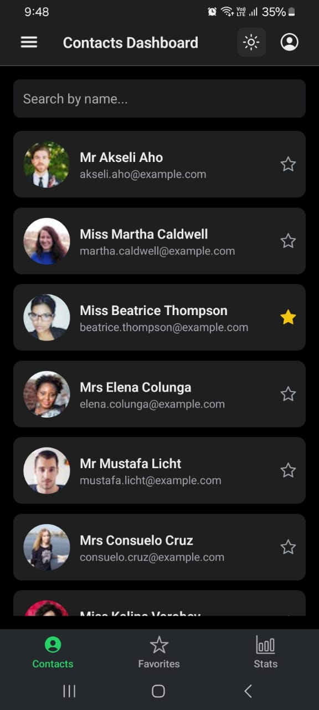
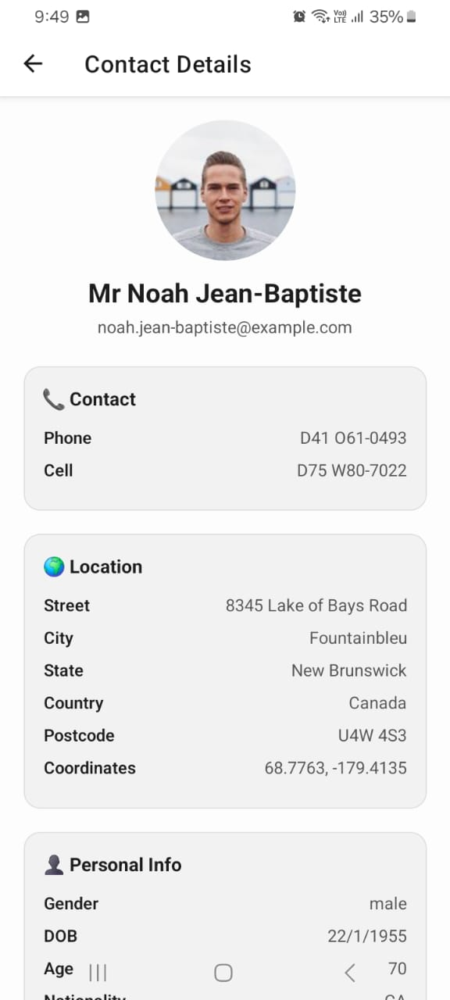
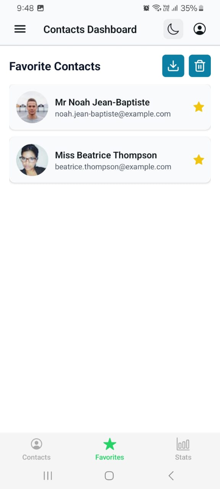
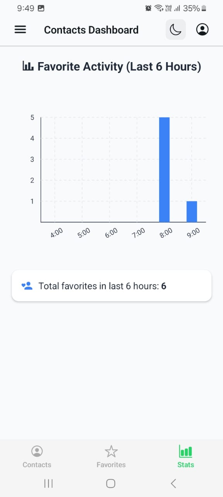

# 📱 Contacts Dashboard App

A React Native (Expo) application that displays a list of contacts fetched from an external API. Users can mark contacts as favorites, view them in a separate tab, and analyze favorite activity statistics in a bar chart — all with persistent local storage and without using any global state management (Redux or Context API).

---

## 🚀 Features

- 📄 Contacts list from [randomuser.me](https://randomuser.me)
- ⭐ Mark/unmark contacts as favorites
- 💾 Persistent local storage with `AsyncStorage`
- 📊 Stats screen showing favorite activity per hour (last 6 hours)
- 🔍 Contact search functionality
- 🌙 Light/Dark theme support
- 📤 Export favorites as a JSON file (Bonus Feature)
- ⚛️ Built with **Expo**, **React Navigation**, **TypeScript**, and **Functional Components**

---

## 📸 Screenshots

| Contacts List | Contact Detail | Favorites | Stats |
|---------------|----------------|-----------|-------|
|  |  |  |  |

---

## 📂 Folder Structure


app/
│
├── tabs/ # Bottom Tab Screens
│ ├── _layout.tsx # Tab Navigator Layout
│ ├── index.tsx # Contacts Screen
│ ├── favorites.tsx # Favorites Screen
│ └── stats.tsx # Stats Screen
│
├── contact/ # Contact Details Screen
│ ├── _layout.tsx
│ ├── email.tsx # Contact Detail UI
│ └── not-found.tsx
│
├── components/ # Reusable UI Components
│ ├── ContactCard.tsx
│ ├── Collapsible.tsx
│ ├── ExternalLink.tsx
│ ├── Graph.tsx
│ ├── Header.tsx
│ ├── HapticTab.tsx
│ ├── HelloWave.tsx
│ ├── ParallaxScrollView.tsx
│ ├── SearchBar.tsx
│ ├── ThemedText.tsx
│ └── ThemedView.tsx
│
├── services/ # API and Storage Services
│ ├── storage.ts # AsyncStorage logic
│ └── timestampTracker.ts # Timestamp tracking for stats
│
├── types/
│ └── types.ts # TypeScript types
│
├── assets/ # Static assets
├── constants/ # Colors, themes, etc.
├── hooks/ # Custom React hooks
├── app.json
├── eas.json
└── eslint.config.js

yaml
Copy
Edit

---

## 🛠️ Technologies Used

- **React Native + Expo**
- **TypeScript**
- **React Navigation (Bottom Tabs)**
- **AsyncStorage** for persistent state
- **expo-file-system** for exporting files
- **Victory Native** for charting (Stats)
- **react-native-svg**
- **Hooks & Functional Components** only

---

## 📈 Stats Logic

- Whenever a user is marked as a favorite, a timestamp is saved with the hour.
- The **Stats Screen** counts the number of favorites added in each of the last 6 hours.
- The data updates in real time based on storage.

---

## 🔐 Constraints Followed

- ❌ No Redux or Context API
- ❌ No props passed for favorite status
- ✅ Favorites stored & fetched using AsyncStorage
- ✅ Stats calculated from saved timestamps

---

## 📦 Installation & Run

```bash
git clone https://github.com/sajal-123/contact_Assignment.git
cd contact_Assignment
npm install
npx expo start
To build APK:

bash
Copy
Edit
eas build -p android --profile preview
Replace preview with your configured EAS profile.

📤 APK
You can find the generated APK file inside the repository or build it using EAS Build.

📬 API Source
Random User API

🧑‍💻 Author
Made with ❤️ by Sajal Garg